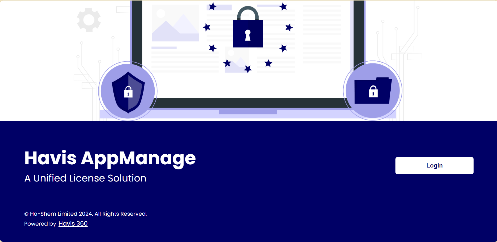

# Havis AppManage

> This is a solution for managing software application's licenses, which caters fro adding customers and the license information to performing other actions on the application. the application also enables users interfacing with the application to view the activation and expiration of licenses and the upgrading and downgrading of customers' licenses based on their license plans while notifying cutomers when the license purchased is closed to expiration.  

SCREENSHOT OF THE APPLICATION )

## Built With

- React Js
- CSS
- Git and Github
- Technologies used

## Live Demo

[Live Demo Link](https:///)

**Instructions on how to access the project locally.**

 To Access my project locally please follow either of the two steps listed below ;

STEP 1
1. Enter this url:  to the git Repository in your web browser.
2. Once opened navigate to the top left level of the project a button Clone will be visible on the righthand side.
3. click on the  button with name "Clone", and copy the url.
4. you will be able to access my project locally.

STEP 2
1. Open command prompt
2. go to the designated folder where you want to clone the repository to.
3. enter  git clone with the clone Url
4. open your designated folder.
5. you will be able to access my project locally.

### Prerequisites
- You should have basic knowledge of React Js
- You should have basic knowledge of CSS
- Also, a basic knowledge of git and github
- A code editor: I used VScode for this project but you can use any code editor of your choice

### Setup
- follow steps on this link to set up VScode code editor: [setup vscode](https://www.freecodecamp.org/news/how-to-set-up-vs-code-for-web-development/)

### Install
[download](https://code.visualstudio.com/download) VScode.
[Watch this video](https://www.youtube.com/watch?v=MlIzFUI1QGA) on how to install VScode on windows

## Author

👤 **Ha-shem Limited**

## 🤝 Contributing

Contributions, issues, and feature requests are welcome!

Feel free to check the [issues page](../../issues/).

## 📝 License

This project is [MIT](./MIT.md) licensed.
